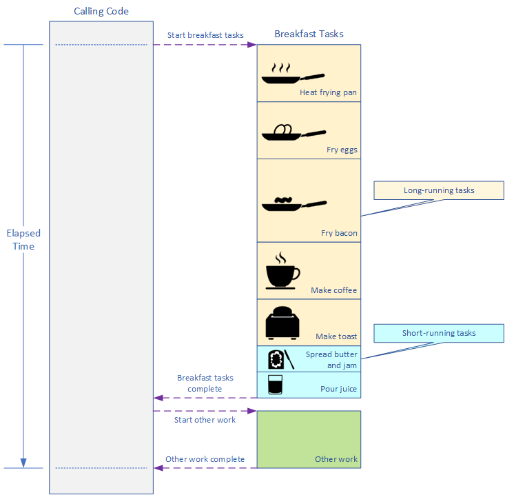
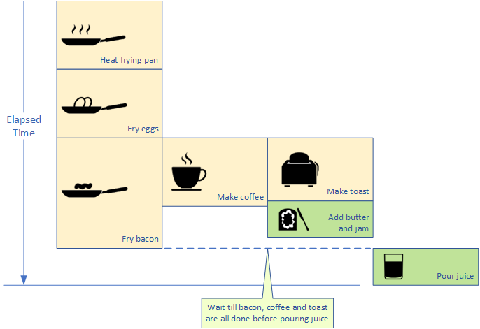
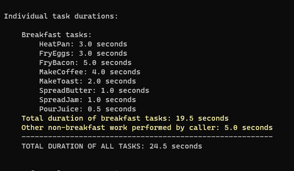
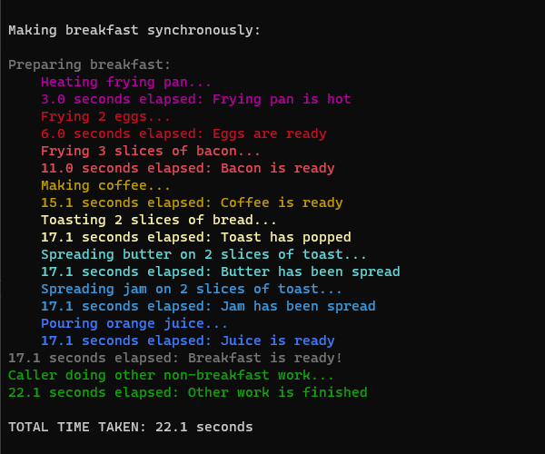
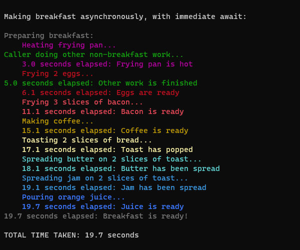
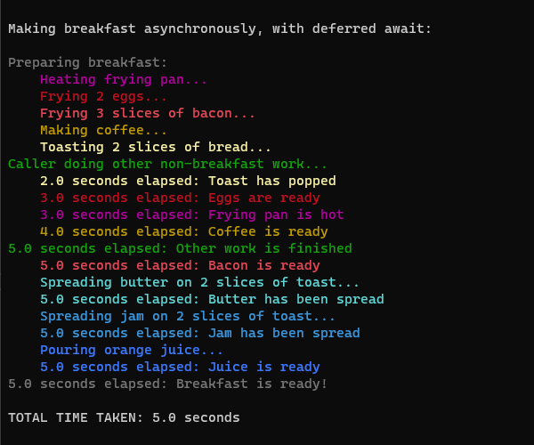
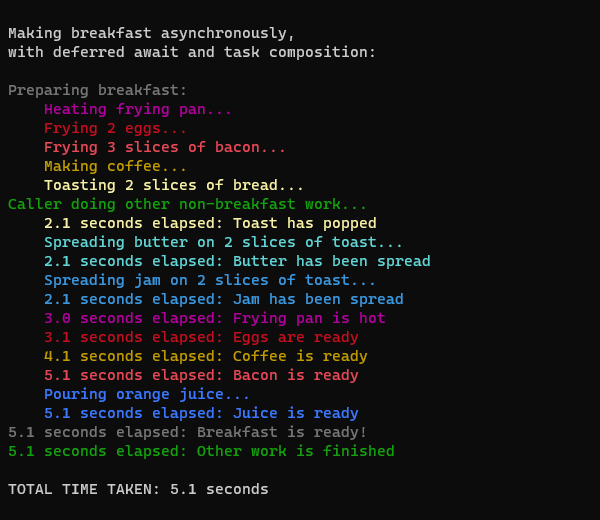
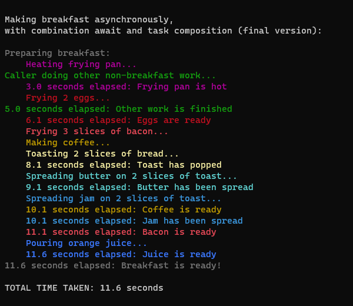

# AsyncDEMO_Net8
A cross-platform console application demonstrating async programming in C# and .NET 8.  It is loosely based on MS article "Asynchronous programming with async and await", https://learn.microsoft.com/en-us/dotnet/csharp/asynchronous-programming/.

The various versions of the code, from fully synchronous to full asynchronous functionality, are saved side-by-side, rather than as different commits in source control.  The different versions can be accessed via a menu.

The scenario developed is cooking breakfast.  The tasks involved are:

1. Make coffee.
2. Heat a frying pan.
3. Fry two eggs.
4. Fry three slices of bacon.
5. Toast two pieces of bread.
6. Spread butter and jam on the toast.
7. Pour a glass of orange juice.

The synchronous version of the code executes the steps in the order shown:



The time to cook breakfast is the sum of the times for each task.

Spreading the butter and jam on the toast and pouring the juice are quick tasks.  Making the coffee, heating the frying pan, frying the eggs, frying the bacon and making the toast are long-running tasks.  Heating the frying pan, frying the eggs and frying the bacon must be done sequentially, since there is only one frying pan.  The other long-running tasks can be done in parallel with the frying, however, to reduce the overall cooking time.  Ideally, we would want the various frying tasks, making the coffee and making the toast to complete at about the same time, so food or drink doesn't get cold.

So the most efficient way of executing the process would be:



This requires the long-running steps to be performed asynchronously.

## Demo Application Task Durations
The various tasks in the demo project have the following durations:



Note that in addition to the tasks required to make breakfast, the calling code has other work to perform as well.

## Synchronous Version
### The Code
Each method representing a breakfast task, such as frying eggs or making toast, or the other work performed by the calling code, has the same three steps:

1. Write to the console that the task is starting;
1. Wait for a fixed delay;
1. Write to the console that the task has finished.

Optionally the method may return a value, such as a `Coffee` object or a `List<Toast>` object.

An example task method:

```C#
private static Coffee MakeCoffee(DateTime startTime)
{
	var taskInfo = TaskInfo.GetTask(TaskId.MakeCoffee);

	taskInfo.WriteInTaskColor("Making coffee...");

	Task.Delay(taskInfo.Duration).Wait();

	taskInfo.WriteWithElapsedTime("Coffee is ready", startTime);

	return new Coffee();
}
```

The synchronous `MakeBreakfast` method just calls each breakfast task in turn:

```C#
public static void MakeBreakfast(DateTime startTime)
{
	var textColor = ConsoleColor.DarkGray;

	ConsoleHelper.WriteInColor("Preparing breakfast:", textColor);

	HeatFryingPan(startTime);

	int numberOfEggs = 2;
	List<Egg> eggs = FryEggs(numberOfEggs, startTime);

	int numberOfBaconSlices = 3;
	List<Bacon> baconSlices = FryBacon(numberOfBaconSlices, startTime);

	Coffee cup = MakeCoffee(startTime);

	int numberOfToastSlices = 2;
	List<Toast> toastSlices = MakeToast(numberOfToastSlices, startTime);

	SpreadButterOnToast(toastSlices, startTime);

	SpreadJamOnToast(toastSlices, startTime);

	Juice juice = PourJuice(startTime);

	ConsoleHelper.WriteWithElapsedTime("Breakfast is ready!", startTime, textColor);
}
```

The calling code calls the `MakeBreakfast` method then the `DoOtherWork` method, which represents the non-breakfast work the caller has to perform.  Finally it will display the time taken to execute the two methods:

```C#
public static void SyncBreakfast()
{
	Console.WriteLine();
	Console.WriteLine("Making breakfast synchronously:");
	Console.WriteLine();

	var startTime = DateTime.Now;

	SyncBreakfastMaker.MakeBreakfast(startTime);

	DoOtherWork(startTime);
	Console.WriteLine();

	ConsoleHelper.WriteTotalTimeTaken(startTime);
}
```

### Execution
The synchronous version of the code executes each breakfast task sequentially, then it executes the other work performed by the calling code.  Since the synchronous code executes each task sequentially its duration is the sum of the durations of each individual task:



## Asynchronous Versions
### Aynchronous Code
While there are various versions of the asynchronous code they all call the same methods that represent breakfast tasks and the other work performed by the calling code.  These methods all have the same three steps as their synchronous equivalents:

1. Write to the console that the task is starting;
1. Wait for a fixed delay;
1. Write to the console that the task has finished.

Optionally a method may return a result, such as a `Coffee` object or a `List<Toast>` object, wrapped in a `Task`.  Methods that don't return a value return a `Task` object without a result.

An example task method:

```C#
protected async Task<Coffee> MakeCoffeeAsync(DateTime startTime)
{
	var taskInfo = TaskInfo.GetTask(TaskId.MakeCoffee);

	taskInfo.WriteInTaskColor("Making coffee...");

	await Task.Delay(taskInfo.Duration);

	taskInfo.WriteWithElapsedTime("Coffee is ready", startTime);

	return new Coffee();
}
```

Each different version of the asynchronous code has its own `MakeBreakfastAsync` method.  However, the caller code is the same for all versions:

```C#
private static async Task MakeBreakfastAsync(string title, Func<DateTime, Task> makeBreakfastMethodAsync)
{
	title = title.Trim();
	if (!title.EndsWith(':'))
	{
		title += ':';
	}

	Console.WriteLine();
	Console.WriteLine(title);
	Console.WriteLine();

	var startTime = DateTime.Now;

	var task = makeBreakfastMethodAsync(startTime);

	DoOtherWork(startTime);

	await task;

	Console.WriteLine();

	ConsoleHelper.WriteTotalTimeTaken(startTime);
}
```

The `makeBreakfastMethodAsync` function represents the asynchronous `MakeBreakfastAsync` method that is being run.

Note the `await` when calling the `makeBreakfastMethodAsync` function is deferred until after the `DoOtherWork` method is executed.  The `DoOtherWork` method is a synchronous method.

### First Asynchronous Version
The first asynchronous version of the `MakeBreakfastAsync` method calls each breakfast task with an immediate `await`.  Note that the short-running methods, `SpreadButterOnToast`, `SpreadJamOnToast` and `PourJuice`, remain synchronous methods as they execute so quickly there would be no benefit in converting them to asynchronous operation:

```C#
public override async Task MakeBreakfastAsync(DateTime startTime)
{
	var textColor = ConsoleColor.DarkGray;

	ConsoleHelper.WriteInColor("Preparing breakfast:", textColor);

	await HeatFryingPanAsync(startTime);

	int numberOfEggs = 2;
	List<Egg> eggs = await FryEggsAsync(numberOfEggs, startTime);

	int numberOfBaconSlices = 3;
	List<Bacon> baconSlices = await FryBaconAsync(numberOfBaconSlices, startTime);

	Coffee cup = await MakeCoffeeAsync(startTime);

	int numberOfToastSlices = 2;
	List<Toast> toastSlices = await MakeToastAsync(numberOfToastSlices, startTime);

	SpreadButterOnToast(toastSlices, startTime);

	SpreadJamOnToast(toastSlices, startTime);

	Juice juice = PourJuice(startTime);

	ConsoleHelper.WriteWithElapsedTime("Breakfast is ready!", startTime, textColor);
}
```

#### Execution
As a result of calling each breakfast task with an immediate `await` the tasks still execute sequentially.  However, the `await`s are non-blocking, so execution can pass back to the calling code while the asynchronous breakfast tasks are executing.  This allows the calling code to complete its other work while the breakfast code is running.  The execution time is now just the sum of the durations of the breakfast tasks; the other work performed by the calling code executes at the same time:



### Asynchronous Version with Deferred awaits
The second asynchronous version of the code defers the `await`s for each asynchronous breakfast task until after all the asynchronous methods have been called:

```C#
public override async Task MakeBreakfastAsync(DateTime startTime)
{
	var textColor = ConsoleColor.DarkGray;

	ConsoleHelper.WriteInColor("Preparing breakfast:", textColor);

	// Problem: Deferring the await for heating the pan and frying the eggs doesn't work: 
	// The pan must be heated before frying the eggs and the eggs must be finished before 
	// frying the bacon.
	Task heatPanTask = HeatFryingPanAsync(startTime);
	
	int numberOfEggs = 2;
	Task<List<Egg>> eggsTask = FryEggsAsync(numberOfEggs, startTime);
	
	int numberOfBaconSlices = 3;
	Task<List<Bacon>> baconSlicesTask = FryBaconAsync(numberOfBaconSlices, startTime);
	
	Task<Coffee> cupTask = MakeCoffeeAsync(startTime);
	
	int numberOfToastSlices = 2;
	Task<List<Toast>> toastSlicesTask = MakeToastAsync(numberOfToastSlices, startTime);

	await heatPanTask;
	var eggs = await eggsTask;
	var baconSlices = await baconSlicesTask;
	var cup = await cupTask;
	var toastSlices = await toastSlicesTask;

	// Second problem: Spreading butter and jam on the toast is delayed until the bacon
	// has finished frying and the coffee has been made, even though spreading butter and
	// jam is only dependent on the toast finishing. 
	SpreadButterOnToast(toastSlices, startTime);

	SpreadJamOnToast(toastSlices, startTime);

	Juice juice = PourJuice(startTime);

	ConsoleHelper.WriteWithElapsedTime("Breakfast is ready!", startTime, textColor);
}
```

#### Execution
As a result of deferring the `await`s the asynchronous tasks execute concurrently, not sequentially, so this version is very fast.  However, it has two problems:

1. The various tasks relating to frying execute in parallel.  So it attempts to fry the eggs before the pan has finished heating, and fry the bacon before the eggs have finished.

1. The tasks for spreading the butter and jam on the toast have to wait for the bacon to finish frying, the coffee to finish brewing, and the toast to finish.  This may result in an unnecessary delay, as spreading the butter and jam should only depend on the toast being ready; it's okay for those tasks to execute while the bacon is still frying and the coffee is still brewing.



### Asynchronous Version with Deferred awaits and Task Composition
The third asynchronous version of the code adds task composition, combining several tasks into a new asynchronous method, `PrepareToastAsync`:

```C#
public override async Task MakeBreakfastAsync(DateTime startTime)
{
	var textColor = ConsoleColor.DarkGray;

	ConsoleHelper.WriteInColor("Preparing breakfast:", textColor);

	// Problem: Deferring the await for heating the pan and frying the eggs doesn't work: 
	// The pan must be heated before frying the eggs and the eggs must be finished before 
	// frying the bacon.
	Task heatPanTask = HeatFryingPanAsync(startTime);

	int numberOfEggs = 2;
	Task<List<Egg>> eggsTask = FryEggsAsync(numberOfEggs, startTime);

	int numberOfBaconSlices = 3;
	Task<List<Bacon>> baconSlicesTask = FryBaconAsync(numberOfBaconSlices, startTime);

	Task<Coffee> cupTask = MakeCoffeeAsync(startTime);

	// The PrepareToastAsync method fixes the second problem: Now spreading butter and jam 
	// on the toast only has to wait for the toast to finish, it no longer has to wait 
	// until the bacon frying and the coffee making have finished.
	int numberOfToastSlices = 2;
	Task<List<Toast>> toastSlicesTask = PrepareToastAsync(numberOfToastSlices, startTime);

	await heatPanTask;
	var eggs = await eggsTask;
	var baconSlices = await baconSlicesTask;
	var cup = await cupTask;
	var toastSlices = await toastSlicesTask;

	Juice juice = PourJuice(startTime);

	ConsoleHelper.WriteWithElapsedTime("Breakfast is ready!", startTime, textColor);
}

private async Task<List<Toast>> PrepareToastAsync(int numberOfSlices, DateTime startTime)
{
	List<Toast> toastSlices = await MakeToastAsync(numberOfSlices, startTime);

	SpreadButterOnToast(toastSlices, startTime);

	SpreadJamOnToast(toastSlices, startTime);

	return toastSlices;
}
```

#### Execution
The new `PrepareToastAsync` method fixes the second problem: Allowing the spreading of the butter and jam to occur even if the bacon is still frying and the coffee is still brewing.  However, this version of `MakeBreakfastAsync` still has the first problem where the various frying-related tasks execute in parallel:



### Final Asynchronous Version
The fourth and final asynchronous version of the code uses a combination of immediate and deferred `await`s along with task composition:

```C#
public override async Task MakeBreakfastAsync(DateTime startTime)
{
	var textColor = ConsoleColor.DarkGray;

	ConsoleHelper.WriteInColor("Preparing breakfast:", textColor);

	// Use immediate awaits for heating the pan and frying the eggs: 
	// This will ensure the pan finishes heating before starting to fry the eggs, and the 
	// eggs finish frying before starting to fry the bacon.  
	await HeatFryingPanAsync(startTime);

	int numberOfEggs = 2;
	List<Egg> eggs = await FryEggsAsync(numberOfEggs, startTime);

	// Defer the await for frying the bacon: We're happy for it to run in parallel with 
	// making the coffee and preparing the toast.  Running the three tasks in parallel 
	// reduces execution time.
	int numberOfBaconSlices = 3;
	Task<List<Bacon>> baconSlicesTask = FryBaconAsync(numberOfBaconSlices, startTime);

	Task<Coffee> cupTask = MakeCoffeeAsync(startTime);

	// The PrepareToastAsync method fixes the second problem: Now spreading butter and jam 
	// on the toast only has to wait for the toast to finish, it no longer has to wait 
	// until the bacon frying and the coffee making have finished.
	int numberOfToastSlices = 2;
	Task<List<Toast>> toastSlicesTask = PrepareToastAsync(numberOfToastSlices, startTime);

	var baconSlices = await baconSlicesTask;
	var cup = await cupTask;
	var toastSlices = await toastSlicesTask;

	Juice juice = PourJuice(startTime);

	ConsoleHelper.WriteWithElapsedTime("Breakfast is ready!", startTime, textColor);
}

private async Task<List<Toast>> PrepareToastAsync(int numberOfSlices, DateTime startTime)
{
	List<Toast> toastSlices = await MakeToastAsync(numberOfSlices, startTime);

	SpreadButterOnToast(toastSlices, startTime);

	SpreadJamOnToast(toastSlices, startTime);

	return toastSlices;
}
```

#### Execution
The combination of immediate and deferred `await`s fixes the first problem, where the various frying-related tasks were executing in parallel.  As a result it runs slower than the purely deferred `await` version of the code, but it executes the tasks in the correct order.  Pouring the juice has to wait until all other breakfast tasks are complete before it runs:



